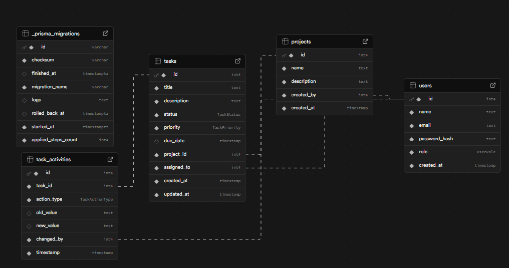

# Task Manager

SupaBase Scheme




## What Is New

- Kanban board for tasks with drag-and-drop status changes
- Task activity log (status changes, reassignments, edits)
- Advanced task filters: `status`, `priority`, `search`, `due_from`, `due_to`, pagination (`page`, `limit`)
- Delete operations for users, projects, and tasks (role-gated)
- Global light/dark theme switch with persisted preference
- Extended i18n: English, Russian, German, Azerbaijani
- Dashboard improvements: status pie chart, member bar chart, project distribution, recent tasks
- Root scripts for faster local launch on Windows (`npm run dev`)

## Stack

### Backend (`backend/`)

| Layer | Technology |
|---|---|
| Runtime | Node.js |
| Framework | NestJS 11 |
| ORM | Prisma |
| Database | PostgreSQL (Supabase) |
| Auth | JWT (Bearer) + Passport + bcrypt |
| Validation | class-validator + class-transformer |

### Frontend (`frontend/`)

| Layer | Technology |
|---|---|
| Build tool | Vite 7 |
| UI | React 19 + TypeScript |
| Styling | Tailwind CSS v4 |
| Data fetching | TanStack Query v5 |
| Routing | React Router v7 |
| Local state | Zustand |
| Charts | Recharts |
| HTTP client | Axios (JWT interceptor + 401 handling) |
| i18n | i18next + react-i18next + language detector |
| Notifications | react-hot-toast |

## Core Features

- JWT authentication with `/auth/login` and `/auth/me`
- Role model: `admin` and `member`
- Admin-only actions:
  - Create/delete users
  - Delete projects
  - Delete tasks
- Projects:
  - Create/list/delete
  - Automatic cleanup of related tasks/activity on delete
- Tasks:
  - Create/list/update/delete
  - Date-safe validation (`YYYY-MM-DD`)
  - Server-side filtering and pagination
  - Kanban movement by drag-and-drop in UI
  - Immutable done-state rule (cannot reopen done task)
  - Activity stream per task
- Dashboard:
  - Tasks by status
  - Tasks by member
  - Tasks by project
  - Recent tasks and completion metrics
- UI/UX:
  - Lazy-loaded pages
  - Global loading states
  - Toast feedback
  - Theme switcher (light/dark)
  - i18n switcher

## Project Structure

```text
nestjsprac/
├── backend/
│   ├── prisma/
│   │   ├── schema.prisma
│   │   ├── seed.ts
│   │   └── migrations/
│   └── src/
│       ├── auth/
│       ├── users/
│       ├── projects/
│       ├── tasks/
│       ├── dashboard/
│       ├── prisma/
│       └── common/
├── frontend/
│   └── src/
│       ├── pages/
│       ├── components/
│       ├── services/
│       ├── store/
│       ├── lib/
│       └── types/
├── image.png
└── README.md
```

## Requirements

- Node.js 20+ (recommended)
- npm 10+
- Supabase project with PostgreSQL
- Windows PowerShell/CMD recommended for this repo scripts

## Environment Setup

Create `backend/.env`:

```env
DATABASE_URL="postgresql://postgres.<project_ref>:<PASSWORD>@aws-1-<region>.pooler.supabase.com:6543/postgres?pgbouncer=true&connection_limit=1&sslmode=require"
DIRECT_URL="postgresql://postgres.<project_ref>:<PASSWORD>@aws-1-<region>.pooler.supabase.com:5432/postgres?sslmode=require"
JWT_SECRET="dev_super_secret_change_me"
PORT="3000"
```

Notes:

- `DATABASE_URL`: pooled connection (runtime, pgbouncer)
- `DIRECT_URL`: direct/session connection (migrations)
- URL-encode special characters in password (`!` -> `%21`, etc.)

## Quick Start

### 1) Backend

```powershell
cd backend
npm install
npx prisma generate
npx prisma migrate deploy
npm run prisma:seed
npm run start:dev
```

### 2) Frontend

```powershell
cd frontend
npm install
npm run dev
```

Frontend requests `/api/*` are proxied to `http://127.0.0.1:3000`.

### 3) Optional root scripts (Windows)

From repo root:

```powershell
npm run backend
npm run frontend
npm run dev
```

`npm run dev` opens backend in a separate `cmd` window and starts frontend in current shell.

## Default Credentials

```text
admin@example.com / admin123
```

## URLs

| Service | URL |
|---|---|
| Frontend SPA | http://localhost:5173 |
| Backend API | http://127.0.0.1:3000 |
| Health/root | http://127.0.0.1:3000/ |
| Static UI (when built) | http://127.0.0.1:3000/ui |

## API Overview

### Auth

| Method | Path | Auth | Description |
|---|---|---|---|
| POST | `/auth/login` | No | Returns `{ access_token }` |
| GET | `/auth/me` | Bearer | Current user profile |

### Users

| Method | Path | Auth | Role |
|---|---|---|---|
| GET | `/users` | Bearer | admin, member |
| POST | `/users` | Bearer | admin |
| DELETE | `/users/:id` | Bearer | admin |

### Projects

| Method | Path | Auth | Role |
|---|---|---|---|
| GET | `/projects` | Bearer | admin, member |
| POST | `/projects` | Bearer | admin, member |
| DELETE | `/projects/:id` | Bearer | admin |

### Tasks

| Method | Path | Auth | Role |
|---|---|---|---|
| GET | `/tasks` | Bearer | admin, member |
| POST | `/tasks` | Bearer | admin, member |
| PATCH | `/tasks/:id` | Bearer | admin, member |
| DELETE | `/tasks/:id` | Bearer | admin |
| GET | `/tasks/:id/activity` | Bearer | admin, member |

Task query params:

- `status`: `todo | in_progress | review | done`
- `priority`: `low | medium | high`
- `assigned_to`: number
- `project_id`: number
- `due_from`: `YYYY-MM-DD`
- `due_to`: `YYYY-MM-DD`
- `search`: string
- `page`: number (default `1`)
- `limit`: number (default `50`, max `100`)

### Dashboard

| Method | Path | Auth | Description |
|---|---|---|---|
| GET | `/dashboard` | Bearer | Aggregates by status/project/user |

## Frontend Routes

| Route | Access | Description |
|---|---|---|
| `/login` | Public | Sign in |
| `/dashboard` | Authenticated | Analytics and summary |
| `/projects` | Authenticated | Project management |
| `/tasks` | Authenticated | Kanban + filters + task activity |
| `/users` | Admin | Team management |

## Language Support

| Code | Language |
|---|---|
| `en` | English |
| `ru` | Russian |
| `de` | German |
| `az` | Azerbaijani |

Language is persisted in browser storage.

## Useful Commands

### Backend

```powershell
cd backend
npm run start:dev
npm run build
npm run lint
npm run db:reset
npx prisma studio
```

### Frontend

```powershell
cd frontend
npm run dev
npm run build
npm run preview
npm run lint
```

## Troubleshooting

### No data appears in UI

Usually one of:

- Migrations were not applied
- Seed was not run
- Backend is not actually running
- Wrong Supabase credentials/project in `.env`

Fix sequence:

```powershell
cd backend
npx prisma migrate deploy
npm run prisma:seed
npm run start:dev
```

### `P1001 Can't reach database server`

Check host/port and network rules. On IPv4-restricted networks, pooled/direct connection host choice may differ.

### `P1000 Authentication failed`

Recheck DB password and URL-encoding.

### `EADDRINUSE: 3000`

Use another port:

```powershell
$env:PORT="3001"
npm run start:dev
```

### Frontend 401 / login loop

- Verify backend is running on `127.0.0.1:3000`
- Verify `JWT_SECRET` is set
- Clear old token from browser localStorage (`tm_token`)

## Security Note

If DB credentials were exposed in logs/chats, rotate the password in Supabase immediately and update `.env`.
